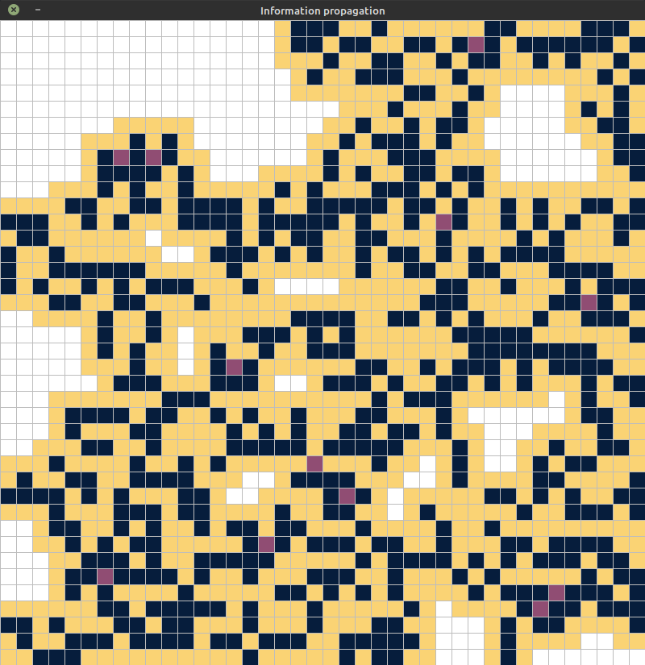

# Information propagation grid  
    
    
## Description    
 This work implements [fuzzy](https://en.wikipedia.org/wiki/Fuzzy_set) [cellular automaton](https://en.wikipedia.org/wiki/Cellular_automaton) which performs modeling of the information propagation process. The code in `main.py` creates a 40x40 grid and places first information propagator close to the middle of the grid, and afterwards starts modeling - iteration after iteration, information points spread to the neighboring cells, causing their trust to the information to grow and then spread it even further. There are two main cell behaviors implemented: normal (more info points gained = more trust to the information) and reversed (more info points = less trust to the information). The visualization is done using [pygame](https://www.pygame.org/wiki/about) on a 800x800px window.  
    
## How to run 
If needed, create virtualenv (at least Python3.8 is needed):    
    
    $ python3 -m venv venv
    $ source venv/bin/activate

Install the required packages:  
  
    $ pip3 install -r requirements.txt  

Run the `main.py`:    
    
    $ python3 main.py  
    
You can edit the `main.py` and `constants.py` to suit the needs of your particular experiment.    

For the reference, there are four main levels of trust and corresponding colors:

 - White: `NULL`
 - Yellow: `LOW`
 - Pink: `MEDIUM`
 - Blue: `HIGH`
